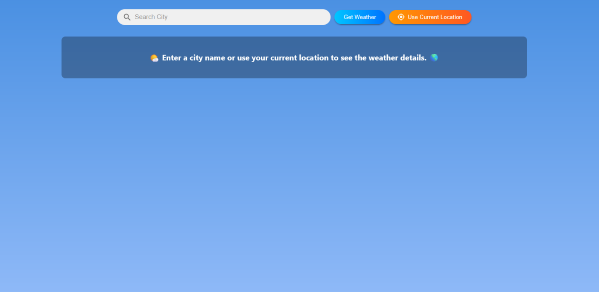
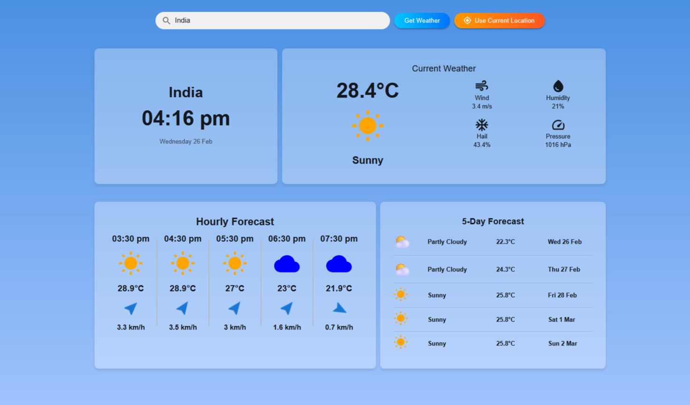

# React Weather App ☁️🌤️

## Description

A simple weather application built using React.js and the [Tomorrow.io](https://www.tomorrow.io/) API. The app allows users to check current weather conditions, 5-day forecasts, and hourly weather updates based on the city they enter or use their current location to get real-time weather updates.

## Live Demo 🌍

[Check Live Here](https://weather-tgwig2ai0-riteeshs-projects-ad4e2342.vercel.app)

## 🚀 Features

✅ Search weather by city  
✅ Get real-time weather updates  
✅ 5-day forecast & hourly updates  
✅ Mobile & Desktop responsive

## Technologies Used

- React.js ⚛️
- Axios for API calls 📡
- Tomorrow.io Weather API 🌦️
- CSS (Material-UI / Custom Styles) 🎨

## Screenshots 📸

### Home Page



### Weather Details



## Installation & Setup 🚀

1. **Clone the repository**

   ```sh
   git clone https://github.com/Riteesh2003/react-weather-app.git
   cd react-weather-app
   ```

2. **Install dependencies**

   ```sh
   npm install
   ```

3. **Run the application**

   ```sh
   npm start
   ```

4. **Deploy to Vercel**
   ```sh
   vercel
   ```

## Deployment 🌎

This project is hosted on [Vercel](https://vercel.com/). You can deploy using:

```sh
vercel --prod
```
